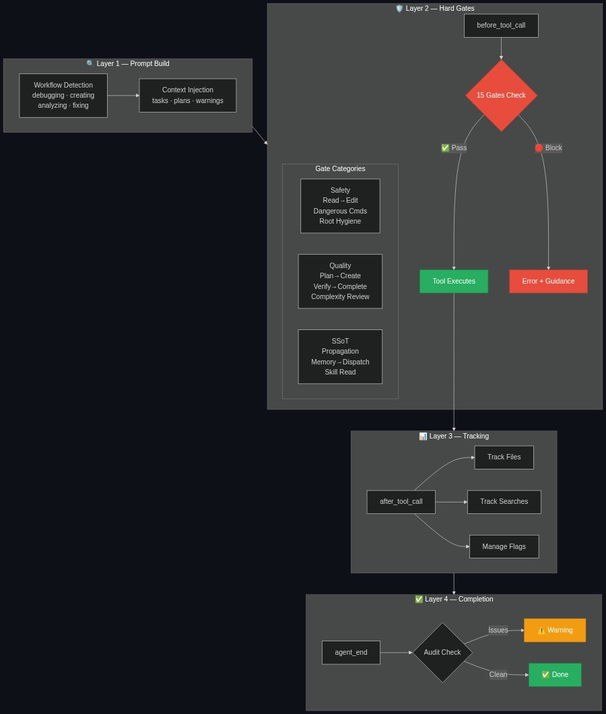

# systematic-claw

**Structural discipline plugin for [OpenClaw](https://openclaw.ai) agents.**

AI agents are powerful but undisciplined. They skip verification, forget to update documentation, edit files they haven't read, and declare "done" prematurely. systematic-claw intercepts every tool call through OpenClaw's hook system and enforces structural discipline; 15 hard gates that block bad patterns before they happen, 4 workflow tools that guide agents through proper processes, and persistent audit logging that tracks everything. The agent doesn't need to *want* to be disciplined; the plugin makes discipline the path of least resistance.

> 7,200 lines of TypeScript. 15 hard gates. 4 workflow tools. Zero config required.



*Four-layer hook pipeline: workflow detection → hard gate enforcement → file/search tracking → completion audit. See [CHANGELOG.md](CHANGELOG.md) for version history.*

## Quick Start

```bash
cd ~/.openclaw/extensions
git clone https://github.com/ilkerbbb/systematic-claw.git
cd systematic-claw
npm install
```

Add to `openclaw.json`:

```json
{
  "plugins": {
    "allow": ["systematic-claw"],
    "entries": {
      "systematic-claw": {
        "enabled": true
      }
    }
  },
  "tools": {
    "alsoAllow": ["group:plugins"]
  }
}
```

Restart your gateway. The plugin works out of the box — zero config needed.

**First-run scaffold:** If your workspace is empty, the plugin creates template files (`STATE.md`, `MEMORY.md`, `SYSTEM/SSOT_REGISTRY.md`) and shows an onboarding guide in the first session.

---

## Hard Gates

Gates run on every tool call (`before_tool_call` hook). In `block` mode (default), they actively prevent the action and return an error message. In `warn` mode, they log but allow.

| # | Gate | What It Enforces |
|---|------|-----------------|
| 1 | **Read before Edit** | Can't edit a file you haven't read. Prevents blind modifications. |
| 2 | **Plan before Create** | Creating new files in a "creating" workflow requires an active plan. |
| 3 | **Verify before Complete** | Can't mark tasks/plans complete without running test/build/lint first. |
| 3b | **Quality Review on Plan Completion** | `plan_mode verify/complete` requires `quality_checklist` when files were changed. |
| 3c | **Related Files on Completion** | Plan completion blocked if related files (per RELATED_FILE_RULES) weren't updated. |
| 4 | **Doom Loop** | 3+ identical tool calls on same file in last 8 calls → redirects to `debug_tracker`. |
| 5 | **Dangerous Commands** | Blocks irreversible shell commands: `rm -rf`, `git push --force`, social media posts, workspace deletion. Configurable regex list. |
| 6 | **Bootstrap File Size** | Warns at 28KB, blocks at 35KB for config/bootstrap files. Prevents context waste. |
| 7 | **Verify-First** | Every 3-4 file writes, a verification command (test/build/lint) must run before more writes. |
| 8 | **Complexity Review** | 2+ modified files without `quality_checklist` → blocked. Forces self-review on multi-file changes. |
| 9 | **SSoT Propagation (Plans)** | `plan_mode create` with 4+ steps or existing modifications → must read `SSOT_REGISTRY.md` first. |
| 9c | **SSoT Awareness (Writes)** | Every workspace file write requires `SSOT_REGISTRY.md` to have been read. Flag resets after each write — continuous enforcement, not one-time. |
| 10 | **Memory before Dispatch** | `sessions_send` to agent sessions requires prior `memory_search` / `lcm_grep` / `lcm_expand_query`. Prevents dispatching without context. |
| 11 | **Skill File Read** | Writing to `skills/X/` requires reading both `X/SKILL.md` and `skill-creator/SKILL.md`. Also enforced for shell write operations (11b). |
| 12 | **Spawn Thinking** | `sessions_spawn` requires a `thinking` parameter. No fire-and-forget sub-agents. |
| 13 | **Workspace Root Hygiene** | Only `.md` files allowed in workspace root. Other file types → blocked. Also enforced for shell writes (13b). |

### Shell Write Detection

Gates 11b and 13b also catch file writes through shell commands (e.g., `echo "..." > file.md`, `cat > file`, `tee file`). The plugin parses shell command text for redirect operators (`>`, `>>`, `tee`, `cat >`) and applies the same gate logic.

---

## Workflow Tools

Four tools are registered and available to agents:

### `task_tracker`

Hierarchical task management with parent-child relationships.

```
Actions: create, update, add_subtask, complete, delete, list, checkpoint, rollback
```

- **Checkpoint/Rollback:** Save task state snapshots before risky work. Up to 10 checkpoints per session.
- **File tracking:** Tasks can list `files_affected` for traceability.
- **Verification evidence:** Record *how* you verified a task is complete.

### `plan_mode`

Structured execution plans: create → approve → execute → verify → complete.

```
Actions: create, approve, advance, complete_step, verify, complete, status, cancel
```

- **4-Lens Brainstorm** (required for 4+ steps): constraints, impact radius, reversibility, success criteria.
- **Alternatives** (required for 4+ steps): at least 2 approaches with trade-off analysis.
- Steps auto-link to `task_tracker` for progress tracking.

### `debug_tracker`

Evidence-based debugging protocol. No fix without a hypothesis.

```
Phases: start → reproduce → hypothesize → test → resolve/escalate
```

- Max 3 failed hypotheses → must escalate to user.
- Each hypothesis needs evidence + test plan.
- Prevents "try random things until it works" debugging.

### `quality_checklist`

Self-review enforcement before session completion.

```
Actions: review, status
```

Five mandatory fields (15+ character minimum, no "N/A"):
1. **Verification** — What commands did you run?
2. **Edge Cases** — What did you consider?
3. **Regression Risk** — What could break?
4. **Gap Analysis** — What's incomplete?
5. **Stress Test** — Did you stress-test?

---

## Hooks

| Hook | What It Does |
|------|-------------|
| `before_prompt_build` | Injects workflow guidance, active plan/task state, gate visibility summary, periodic warnings, onboarding message (first run) |
| `before_tool_call` | Runs all 15 hard gates |
| `after_tool_call` | Tracks file reads/writes, detects verification commands, records memory searches, clears SSoT flags after writes |
| `agent_end` | Completion checklist: open tasks? unverified changes? missing memory writes? |

### Gate Visibility

Controlled by `gateVerbosity` config:

- **`silent`** — No gate annotations in prompts
- **`summary`** (default) — Single line: "✅ Gates: N checks, N blocks, N warnings"
- **`verbose`** — Per-gate breakdown with names and counts

---

## Workflow Detection

The plugin analyzes each prompt to detect the type of work and inject relevant guidance:

| Workflow | Example Keywords (EN) | Example Keywords (TR) | Guidance |
|----------|----------------------|----------------------|----------|
| 🔍 Debugging | error, bug, crash, stuck, not working | hata, bozuk, patladı, takıldı, arıza | Use `debug_tracker`, root cause first |
| 🏗️ Creating | create, build, new, deploy, generate | oluştur, hazırla, tasarla, başlat, taslak | Plan first, then execute step by step |
| 📊 Analyzing | analyze, review, check, monitor, status | analiz, incele, kontrol et, listele, durum | Gather data, synthesize, question assumptions |
| 🔧 Fixing | fix, update, remove, rollback, configure | düzelt, güncelle, kaldır, sıfırla, ayarla | Read before edit, update related files |

> ~189 keywords total across both languages. See `src/hooks/prompt-inject.ts` for the full regex set.

---

## Related File Rules

When certain files are modified, the plugin warns (or blocks on plan completion) if related files aren't also updated. Built-in rules:

| When You Change... | Also Update... |
|-------------------|---------------|
| `STATE.md` | `MEMORY.md` |
| `MEMORY.md` | `STATE.md` |
| `SOUL.md`, `AGENTS.md` | `MEMORY.md` |
| `SKILL.md` | `TOOLS.md` |
| Files in `skills/` | `TOOLS.md` |
| Cron configurations | `CRON_INVENTORY.md` |

Rules are scoped to workspace files. Plugin source code (`extensions/`, `plugins/`) is excluded to prevent false positives.

---

## Configuration

All settings have sensible defaults. Override only what you need:

```json
{
  "plugins": {
    "entries": {
      "systematic-claw": {
        "enabled": true,
        "config": {
          "gateMode": "block",
          "gateVerbosity": "summary",
          "taskTrackerEnabled": true,
          "planModeEnabled": true,
          "completionCheckEnabled": true,
          "memoryEnforcementEnabled": true,
          "debugTrackerEnabled": true,
          "workflowDetectionEnabled": true,
          "propagationEnabled": true,
          "scaffoldOnFirstRun": true,
          "workspaceRoot": "~/.openclaw/workspace",
          "dangerousCommands": [],
          "bootstrapSizeWarnKB": 28,
          "bootstrapSizeBlockKB": 35,
          "dependencyMapPath": null
        }
      }
    }
  }
}
```

### Key Options

| Option | Type | Default | Description |
|--------|------|---------|-------------|
| `gateMode` | `"block"` \| `"warn"` | `"block"` | Hard gates block or just warn |
| `gateVerbosity` | `"silent"` \| `"summary"` \| `"verbose"` | `"summary"` | Gate activity visibility in prompts |
| `scaffoldOnFirstRun` | boolean | `true` | Create template workspace files on first run |
| `workspaceRoot` | string | `~/.openclaw/workspace` | Workspace directory for file gates |
| `dangerousCommands` | string[] | (built-in list) | Additional regex patterns for Gate 5 |
| `bootstrapSizeWarnKB` | number | 28 | File size warning threshold |
| `bootstrapSizeBlockKB` | number | 35 | File size block threshold |
| `dependencyMapPath` | string | null | Custom file dependency map for propagation |

### Custom Dependency Map

For project-specific propagation rules:

```json
{
  "dependencyMapPath": "./dependency-map.json"
}
```

Format:
```json
{
  "src/api.ts": ["src/api.test.ts", "docs/api.md"],
  "src/schema.ts": ["src/schema.test.ts", "src/migrations/"]
}
```

---

## First-Run Scaffold

On first load, if the workspace has no existing files, the plugin creates:

| File | Purpose |
|------|---------|
| `STATE.md` | Track active tasks and project status |
| `MEMORY.md` | Store decisions, facts, and learnings |
| `SYSTEM/SSOT_REGISTRY.md` | Map which file is the single source of truth for what |

An onboarding message explains these files and how gates use them. The scaffold only runs once (tracked via database flag) and skips entirely if any workspace files already exist.

---

## Architecture

```
index.ts                          Entry point, hook registration, scaffold orchestration
src/
├── hooks/
│   ├── prompt-inject.ts          Layer 1: workflow detection, context + gate visibility injection
│   ├── hard-gates.ts             Layer 2: 15 hard gates (before_tool_call)
│   ├── tool-verify.ts            Layer 3: file/search tracking, SSoT flag management (after_tool_call)
│   └── completion-check.ts       Layer 3: end-of-session quality audit (agent_end)
├── tools/
│   ├── task-tracker.ts           Hierarchical tasks with checkpoint/rollback
│   ├── plan-mode.ts              Plan → approve → execute → verify workflow
│   ├── debug-tracker.ts          4-phase systematic debugging
│   ├── quality-checklist.ts      Self-review enforcement
│   └── common.ts                 Related file rules, dependency map, path utilities
├── store/
│   ├── session-state.ts          In-memory + SQLite session state (files, gates, flags)
│   ├── audit-log.ts              Persistent audit trail
│   ├── schema.ts                 Database migrations (v1 → v3)
│   └── connection.ts             SQLite connection pooling
└── scaffold.ts                   First-run workspace template creation + onboarding
```

### Design Principles

- **Shell tools fail-closed:** If the gate system errors on a shell command, it's blocked (safety first).
- **Non-shell tools fail-open:** Gate errors on read/write tools allow through (availability over safety for non-destructive ops).
- **Portable:** No hardcoded user paths. Uses `$HOME` resolution. Works on any machine.
- **Zero config:** Every setting has a sensible default. Install → restart → working.
- **Persistent audit:** SQLite stores gate blocks, warnings, and session history across restarts.
- **In-memory speed:** Session state (read files, write counts, gate flags) is in-memory Maps for zero-latency gate checks. SQLite is for persistence and cross-session context.

---

## Development

```bash
npm install

# Type check (no build step — OpenClaw loads TypeScript directly)
npx tsc --noEmit

# Verify no hardcoded paths
grep -r '/Users/' src/

# Test after changes
openclaw gateway restart
```

---

## License

MIT
